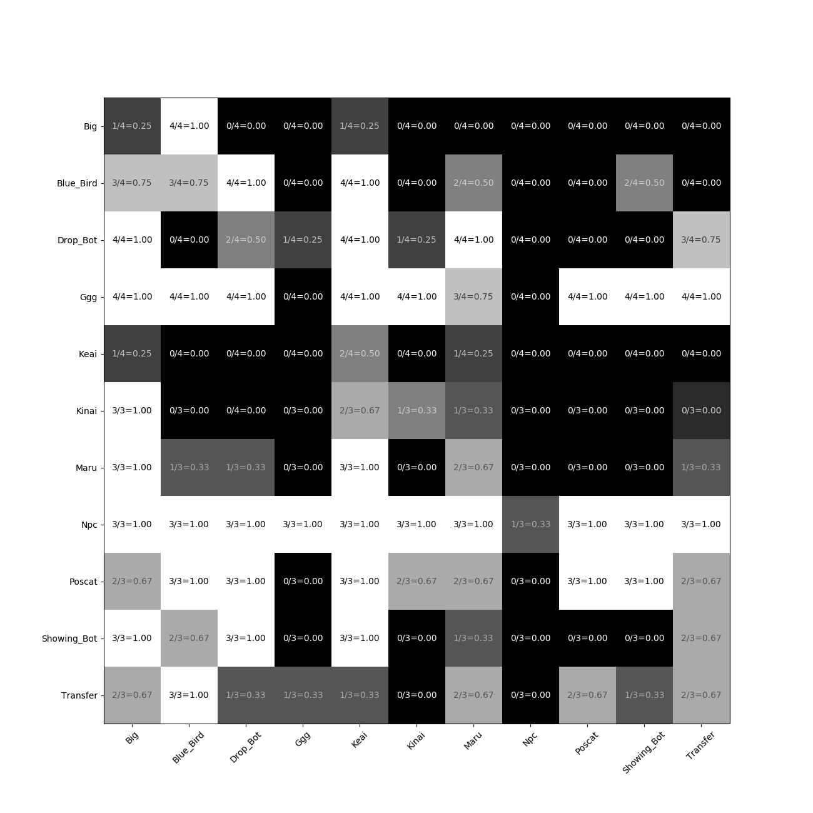
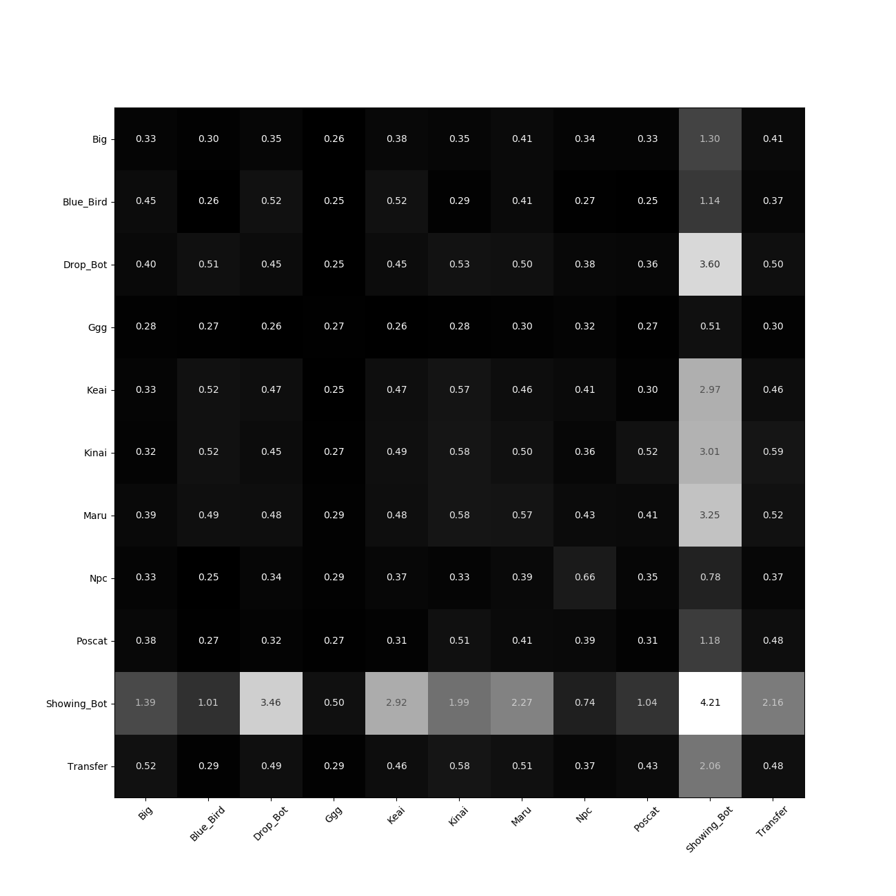
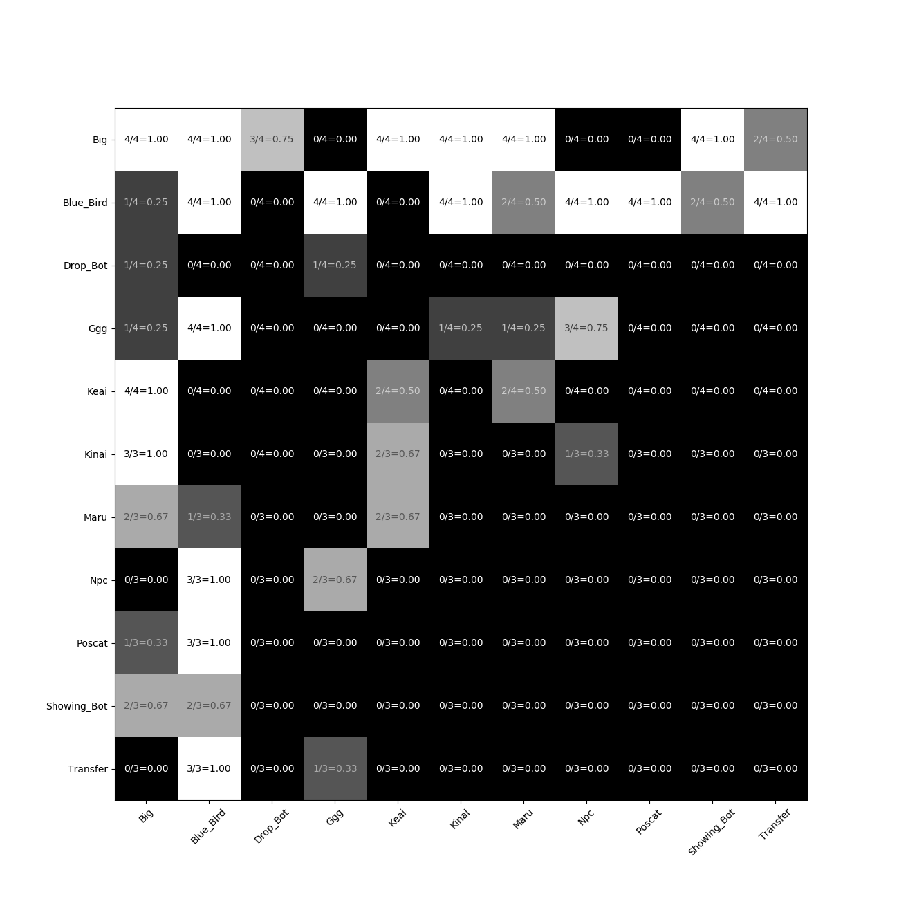

평가결과 요약
==============

- NCFellowship-2019-m1-v6.SC2Map 사용
   - 이전 맵은 무작위로 시작위치가 결정되었지만, v6는 플레이어 1은 오른쪽 아래, 
     플레이어 2는 왼쪽 위로 시작위치가 결정되어 있음
   - 모든 봇에게 동일한 횟수로 시작위치를 지정하기 하기위해 사용

summary.xlsx
-----------------------

- 평가 결과 요약, 평균 승률로 정렬
   - bot: 평가 시스템에서 사용한 bot이름
      - drop_bot: nc_example_v6
      - big: 빅볶음
      - blue_bird: bluebird
      - ggg: 지지자불호여자
      - keai: Ke'ai
      - kinai: KINAI
      - maru: 마루
      - npc: NPC
      - poscat: POSCAT
      - transfer: 인공지능으로 환승
      - showing_bot: abs("tae-bo")
   - win_ratio: 모든 게임 평균 승률
   - #wins (p1): 플레이어 1으로 승리 횟수
   - #games (p1): 플레이어 1으로 게임 횟수
   - win_ratio (p1): 플레이어 1으로 승률
   - #wins (p2): 플레이어 2으로 승리 횟수
   - #games (p2): 플레이어 2으로 게임 횟수
   - win_ratio (p2): 플레이어 2으로 승률
   - #errors: 이 bot이 참가한 게임에서 에러가 발생한 평균 횟수
      - 에러가 발생한 원인이 이 bot인지, 상대 bot인지, 
        플랫홈이나 평가시스템 때문인지는 기록되지 않기 때문에 
        리플레이나 로그파일을 보고 원인을 파악할 필요가 있음
   - play_time: 이 bot이 참가한 게임의 평균 플레이 시간
   
     
result.csv
------------

- csv 형식으로 평가 게임 결과를 기록, 이 결과를 바탕으로 나머지 정보를 추출함
   - {라운드 id},{플레이어 1},{플레이어 2},{맵이름},{실시간 옵션 사용},
     {플레이어 1 점수}{플레이어 2 점수}{에러 발생},{게임 플레이 시간}
   - 예: 0,drop_bot_1,drop_bot_2,NCFellowship-2019_m1_v6,False,1.0,0.0,0.0,24
      - 플레이어 1 (drop_bot_1)과 플레이어 1 (drop_bot_2)과 v6 맵에서 
        실시간=False 옵션으로 첫 번째(0)로 게임을 플레이 했으며, 플레이어 1이 승리, 
        에러는 발생하지 않았으며, 게임 시간은 총 24초 소모
   - 점수가 1.0이면 승리, 0.0 이면 패배, 두 플레이어 점수의 합은 1.0이 되어야 함
   - 게임 시간은 실제 시간을 의미함, 이 시간이 지나치게 크다면 이 게임에 참가하는 bot이 
     너무 많은 시스템 자원을 사용하거나, 버그가 있을 가능성이 있음

score_as_player1.png
-----------------------

- 개별 bot끼리 평균 승률(플레이어 1기준)
   - 플레이어 1 (y축)과 플레이어 2 (x축)이 게임을 했을 때 플레이어 1의 승률을 
     두 bot이 교차하는 부분에 표시
   - 플레이어 1 승률을 1.0에서 빼면 플레이어 2 승률을 알 수 있음
      - {승리 횟수}/{게임 횟수}={승률}

play_time.png
-----------------------

- 개별 bot끼리 평균 게임 시간
   - 게임 플레이에 소모된 실제 시간(분)의 평균
   - 특정 bot끼리 게임에서 게임 플레이 시간이 지나치게 크거나 작다면, bot 비효율적으로 
     코딩되어 있거나 버그가 있을 수 있음

error.png
-----------------------

- 개별 bot끼리 게임에서 평균 에러 발생 횟수
   - 두 bot 중 하나에서 에러가 발생하면, 에러가 발생하지 않은 bot이 승리하고, 에러 발생 횟수가 1로 설정됨
      - {에러 발생 게임}/{전체 게임}={에러 발생 비율}
   - 특정 bot끼리 게임에서 계속 에러가 발생한다면, 리플레이 파일이나, 콘솔 로그 파일을 
     확인해서 해결해야 함

replays
----------

- 모든 게임의 리플레이 파일과, 콘솔 출력결과
   - 리플레이 파일: replay/{플레이어 1}-{플레이어 2}/{플레이어 1}-{플레이어 2}-{라운드 id}.SC2Replay
      - 사용한 맵 파일을 "C:\Program Files (x86)\StarCraft II\Maps"에 복사한 뒤, 
        리플레이 파일을 더블클릭해서 재생 가능
   - 콘솔 출력 로그: replay/{플레이어 1}-{플레이어 2}/{플레이어 1}-{플레이어 2}-{라운드 id}.log
      - 게임 도중 화면엔 출력된 결과를 기록한 파일
      - stdout과 stderr로 나눠서 기록되어 있음
